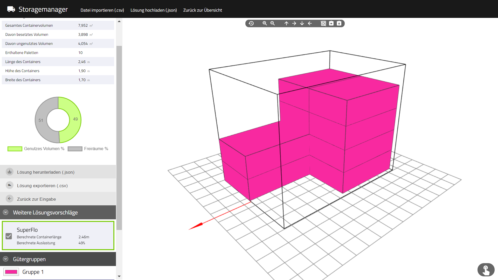

# storage-mgmr
The project contains a c#-backend for calculating the best combination of a given data set of orders. The application was implemented in 2019 for the "IM Challenge" at TU Dresden.

The frontend was implemented using jQuery and three.js, a library for 3D web rendering.

